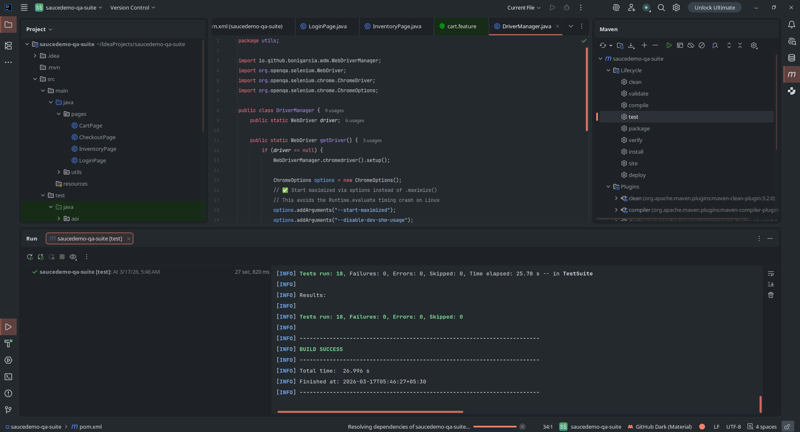

# SauceDemo QA Automation Suite

An end-to-end QA automation framework built to test the **SauceDemo web application**.  
The framework covers **UI automation, API testing, and BDD scenarios**, following industry-standard testing practices such as **Page Object Model (POM)** and **TestNG suite execution**.

## Tech Stack
- Selenium WebDriver 4.x
- TestNG 7.x
- Cucumber BDD 7.x
- Rest Assured 5.x
- Java 17
- Maven

## Project Structure
- `pages/` — Page Object Model classes
- `tests/` — TestNG UI test classes  
- `api/` — Rest Assured API tests
- `stepDefs/` — Cucumber step definitions
- `features/` — Gherkin feature files

## How to Run
```bash
mvn test
```

## Test Results

