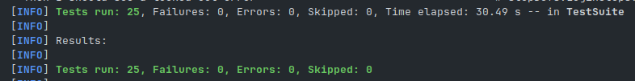
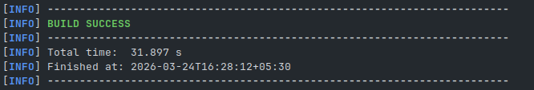

# 🧪 SauceDemo QA Automation Suite

> A production-grade end-to-end test automation framework built with **Selenium WebDriver**, **TestNG**, **Cucumber BDD**, and **Rest Assured** — targeting the SauceDemo web application with 25 automated tests across UI, BDD, and API layers.


---

## 📸 Test Results

<p align="center">
  
</p>
<p align="center">
  
</p>

---

## ✨ Features

- ✅ **UI Automation** — Full E2E flows: login, inventory, cart, and checkout using Selenium WebDriver 4.x
- ✅ **Page Object Model** — 4 dedicated page classes with clean separation of locators and actions
- ✅ **BDD with Cucumber** — Business-readable Gherkin feature files with Java step definitions
- ✅ **API Testing** — CRUD operation validation using Rest Assured 5.x with Hamcrest assertions
- ✅ **Auto ChromeDriver** — WebDriverManager handles driver version management automatically
- ✅ **Browser Interference Handling** — ChromeOptions configured to suppress password popups and notifications
- ✅ **Grouped Test Execution** — testng.xml organises UI, BDD, and API suites independently

---

## 🛠️ Tech Stack

| Tool | Version | Purpose |
|------|---------|---------|
| Java | 17 | Core language |
| Selenium WebDriver | 4.18.1 | Browser automation |
| TestNG | 7.9.0 | Test runner and reporting |
| Cucumber | 7.15.0 | BDD framework |
| Rest Assured | 5.4.0 | API test automation |
| WebDriverManager | 5.7.0 | Auto ChromeDriver setup |
| Maven | 3.x | Build and dependency management |
| SLF4J Simple | 2.0.12 | Logging |

---

## 📁 Project Structure

```
saucedemo-qa-suite/
├── pom.xml
├── testng.xml
├── Demo.png
├── README.md
└── src/
    ├── main/java/
    │   ├── pages/
    │   │   ├── LoginPage.java         # Login page — locators + actions
    │   │   ├── InventoryPage.java     # Product listing — add to cart, sort
    │   │   ├── CartPage.java          # Cart management — view, remove, checkout
    │   │   └── CheckoutPage.java      # Checkout form — fill, submit, verify
    │   └── utils/
    │       └── DriverManager.java     # Singleton WebDriver — opens and closes Chrome
    └── test/
        ├── java/
        │   ├── tests/
        │   │   ├── LoginTest.java     # 3 TestNG tests — authentication flows
        │   │   └── CartTest.java      # 8 TestNG tests — cart and checkout E2E
        │   ├── api/
        │   │   └── UserApiTest.java   # 5 Rest Assured tests — CRUD on JSONPlaceholder
        │   ├── stepDefs/
        │   │   ├── LoginSteps.java    # Cucumber step definitions for login.feature
        │   │   └── CartSteps.java     # Cucumber step definitions for cart.feature
        │   └── runners/
        │       └── TestRunner.java    # Bridges Cucumber with TestNG
        └── resources/
            ├── features/
            │   ├── login.feature      # 3 BDD scenarios — login flows
            │   └── cart.feature       # 4 BDD scenarios — cart flows
            ├── logging.properties     # Suppresses CDP version mismatch warnings
            └── testng.xml             # Suite configuration
```

---

## 🚀 Getting Started

### Prerequisites

- Java 17+
- Maven 3.x
- Google Chrome (any recent version)

### Clone the repository

```bash
git clone https://github.com/vishalshahh/saucedemo-qa-suite.git
cd saucedemo-qa-suite
```

### Run all 25 tests

```bash
mvn test
```

### Run only UI tests

```bash
mvn test -Dtest=LoginTest,CartTest
```

### Run only API tests

```bash
mvn test -Dtest=UserApiTest
```

---

## 🧩 Complete Test Coverage

### UI Tests — `LoginTest.java` (3 tests)

| Test | Description |
|------|-------------|
| `testValidLogin` | Valid credentials redirect to inventory page |
| `testInvalidLogin` | Invalid credentials display error message |
| `testLockedOutUser` | Locked account shows specific locked-out error |

### UI Tests — `CartTest.java` (8 tests)

| Test | Description |
|------|-------------|
| `testInventoryItemCount` | Inventory displays exactly 6 products |
| `testInventoryPageTitle` | Page title shows "Products" |
| `testSortByPriceLowToHigh` | Price sort order is correctly ascending |
| `testAddItemToCart` | Cart badge updates to 1 after adding item |
| `testItemAppearsInCart` | Added item is visible on cart page |
| `testCartItemCount` | Cart reflects correct item count |
| `testRemoveItemFromCart` | Item count decreases by 1 after removal |
| `testContinueShopping` | Returns to inventory from cart page |
| `testCompleteCheckoutFlow` | Full E2E order placement succeeds |
| `testCheckoutWithoutInfo` | Error shown when checkout info is missing |

### API Tests — `UserApiTest.java` (5 tests)

| Test | Description |
|------|-------------|
| `testGetUser` | GET /users/1 returns 200 with valid user data |
| `testGetAllPosts` | GET /posts returns 200 with non-empty list |
| `testCreatePost` | POST /posts returns 201 with correct body |
| `testDeletePost` | DELETE /posts/1 returns 200 |
| `testUserNotFound` | GET /users/9999 returns 404 |

### BDD Tests — Cucumber (7 scenarios)

**login.feature — 3 scenarios**

| Scenario | Description |
|----------|-------------|
| Successful login | Valid credentials redirect to inventory |
| Invalid credentials | Error message displayed |
| Locked out user | Locked account error shown |

**cart.feature — 4 scenarios**

| Scenario | Description |
|----------|-------------|
| Add single item to cart | Cart badge shows 1 |
| Add specific item by name | Named item visible in cart |
| Remove item from cart | Cart is empty after removal |
| Complete full checkout | Full E2E checkout flow succeeds |

---

## 📐 Design Patterns Used

### Page Object Model (POM)
Each page of the application has a dedicated Java class containing all locators and action methods. Tests call page methods — never touching locators directly. When SauceDemo updated their CSS class names mid-project, updating one locator in one class fixed all dependent tests automatically.

### Singleton WebDriver
`DriverManager` maintains one WebDriver instance per test lifecycle. `@BeforeMethod` opens Chrome via `getDriver()`, `@AfterMethod` closes it via `quitDriver()` and resets the instance — guaranteeing each test starts with a clean browser state.

### BDD — Behavior Driven Development
Cucumber feature files written in plain Gherkin (`Given`, `When`, `Then`) allow non-technical stakeholders to read and verify test scenarios without understanding Java. Step definitions bridge the Gherkin steps to POM page class methods.

---

## 🐛 Real Bugs Found and Fixed During Development

| Bug | Error | Root Cause | Fix Applied |
|-----|-------|-----------|-------------|
| All API tests returning 403 | `Expected 201 but was 403` | `reqres.in` moved to paid tier | Switched base URI to `jsonplaceholder.typicode.com` |
| Checkout total not found | `NoSuchElementException: .summary_total_label` | SauceDemo updated CSS class name | Switched to `[data-test='total-label']` selector |
| Chrome startup crash | `WebDriverException: Runtime.evaluate not found` | Chrome 146 timing on Linux | Replaced `.maximize()` with `--start-maximized` flag |
| Password popup blocking tests | `TimeoutException on [data-test='firstName']` | Chrome password breach dialog intercepting clicks | Disabled via `ChromeOptions` prefs: `credentials_enable_service=false` |
| Remove button not working | `expected [0] but found [1]` | SauceDemo updated remove button selector | Switched to `[data-test^='remove']` attribute selector |
| Cucumber DataTable mismatch | `Step defined with 0 parameters but has 1 argument` | Stray markdown table in `.feature` file | Cleaned `cart.feature` — removed accidentally appended content |

---

## 💡 Key Technical Decisions

**Why `data-test` attributes over CSS classes?**
`data-test` attributes are specifically added for testing and are far more resilient to UI redesigns than CSS class names. This project demonstrated that exactly — SauceDemo changed their CSS classes mid-development while `data-test` attributes remained stable.

**Why explicit wait over implicit wait?**
Explicit wait with `ExpectedConditions` waits for a precise condition on a specific element. Implicit wait is global and blunt. Mixing both causes unpredictable delays. Every wait in this project uses `WebDriverWait` with a specific condition.

**Why disable Chrome password manager in ChromeOptions?**
Chrome's password breach detection displayed a "Change your password" dialog because `secret_sauce` is a known compromised credential. The popup blocked all subsequent click actions. Disabling it via `prefs` (`credentials_enable_service: false`) is the correct automation-layer fix — not a workaround.

**Why switch from reqres.in to JSONPlaceholder?**
`reqres.in` moved their API endpoints behind a paywall and began returning 403 Forbidden for all requests. Rather than introducing API key management complexity, switching to `jsonplaceholder.typicode.com` — a purpose-built free testing API — was the cleaner solution.

---

## 👨‍💻 Author

**Vishal Shah** — CS Graduate | QA Automation Engineer

[](https://linkedin.com/in/vishalshahh)
[](https://github.com/vishalshahh)
[](https://vishy.dev)
[](https://twitter.com/vishalshahh)
